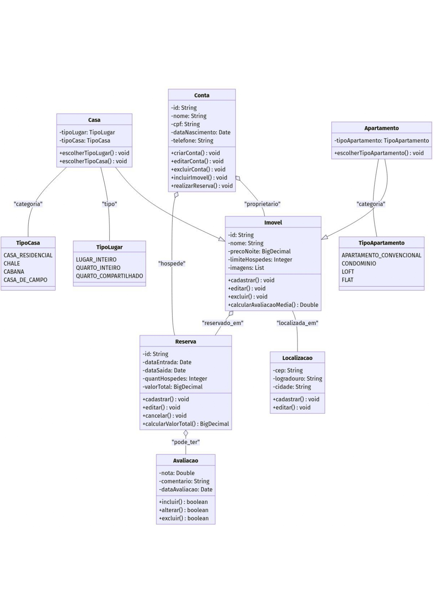

# Projeto Travelar: Documentação e Backlog

Este repositório centraliza toda a documentação de arquitetura, diagramas e o backlog de produto para o projeto Travelar. O objetivo é manter um registro claro e acessível das decisões de design e do planejamento de desenvolvimento do software.

## Diagramas de Arquitetura

Os diagramas a seguir representam a estrutura e o fluxo de dados planejados para a aplicação.

### Diagrama de Classes

### Diagrama de Fluxo de Dados

## Backlog

O backlog é gerenciado de forma interativa na aba Projects deste repositório. A tabela a seguir apresenta um resumo das Histórias de Usuário (US) planejadas para o desenvolvimento.

ID	    História de Usuário	
US-01	Como usuário, quero gerenciar minha conta para manter meus dados atualizados.
US-02	Como proprietário, quero gerenciar meus imóveis para disponibilizá-los para aluguel.
US-03	Como cliente, quero gerenciar minhas reservas para garantir e organizar minhas hospedagens.
US-04	Como cliente, quero gerenciar meus cartões para realizar transações de forma segura.
US-05	Como cliente, quero avaliar uma hospedagem para compartilhar minha experiência.
US-06	Como cliente, quero buscar imóveis por cidade para encontrar opções no meu destino.
US-07	Como cliente, quero filtrar a busca por número de hóspedes para garantir acomodação adequada.
US-08	Como cliente, quero buscar imóveis por período para verificar a disponibilidade.
US-09	Como cliente, quero filtrar imóveis por tipo (casa/apartamento) conforme minha preferência.
US-10	Como cliente, quero filtrar imóveis por faixa de preço para encontrar opções no meu orçamento.

## Protótipo

Telas do protótipo do projeto feito no vO

