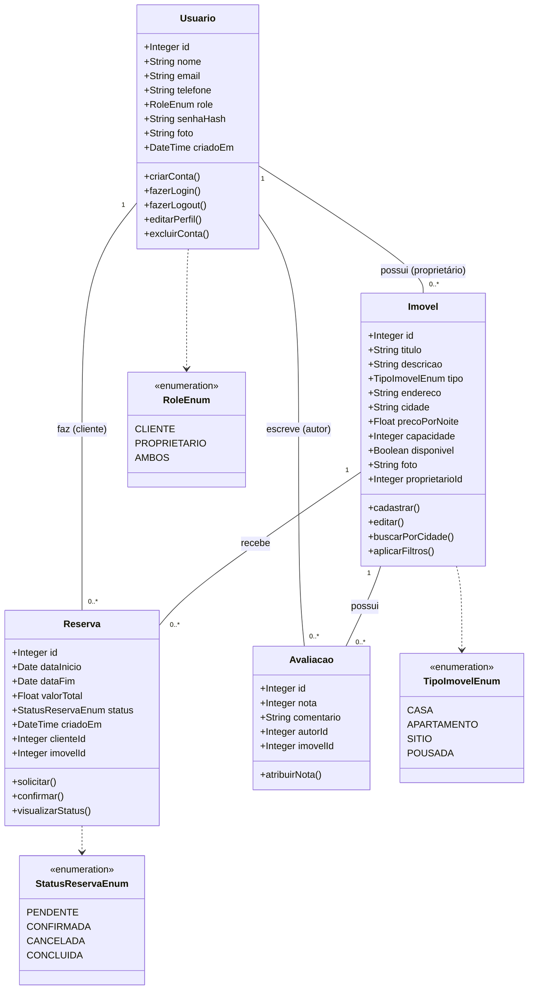

# Diagrama de Classes e Fluxo de Dados

---

## 1. Introdução

Este documento apresenta a estrutura estática orientada a objetos do sistema **Travelar**. O Diagrama de Classes aqui detalhado serve como a planta baixa para a implementação do backend, definindo os atributos, os métodos essenciais e a cardinalidade dos relacionamentos entre as entidades.

---

## 2. Diagrama de Classes (UML)

A representação visual abaixo foi gerada utilizando a sintaxe Mermaid, facilitando a visualização dos acoplamentos e dependências.

---

## Diagrama de Fluxo de Dados

## 3. Detalhes do Diagrama de Classes

Abaixo, detalhamos as responsabilidades de cada classe e a origem de seus métodos no Backlog.

### 3.1. Classe `Usuario`

Representa todos os atores do sistema. A distinção entre quem aluga e quem hospeda é feita pelo atributo `role`, simplificando a arquitetura e evitando heranças desnecessárias nesta etapa.

- **Atributos Chave:** `nome`, `email` (único), `senhaHash` (segurança), `role` (perfil).
- **Métodos Principais:**
  - `criarConta()`: Atende a **US-01**.
  - `fazerLogin()` / `fazerLogout()`: Atende a **US-02** e **US-03**.
  - `editarPerfil()`: Atende a **US-04**.

### 3.2. Classe `Imovel`

Representa a unidade de negócio principal da plataforma. Contém os dados físicos e descritivos da propriedade.

- **Atributos Chave:** `precoPorNoite`, `capacidade`, `cidade`, `disponivel`.
- **Métodos Principais:**
  - `cadastrar()` / `editar()`: Ações do proprietário (**US-06**, **US-07**).
  - `buscarPorCidade()` / `aplicarFiltros()`: Ações de busca do cliente (**US-08**, **US-09**).

### 3.3. Classe `Reserva`

Classe associativa que materializa a transação entre um Cliente e um Imóvel. É temporal (tem início e fim) e possui um ciclo de vida (status).

- **Atributos Chave:** `dataInicio`, `dataFim`, `valorTotal`, `status`.
- **Métodos Principais:**
  - `solicitar()`: Inicia o processo (**US-10**).
  - `confirmar()`: Ação do proprietário para validar a estadia (**US-11**).
  - `visualizarStatus()`: Acompanhamento pelo cliente (**US-12**).

### 3.4. Classe `Avaliacao`

Responsável por armazenar o feedback qualitativo e quantitativo da experiência.

- **Atributos Chave:** `nota` (Inteiro de 1 a 5), `comentario`.
- **Métodos Principais:**
  - `atribuirNota()`: Finaliza a jornada do cliente (**US-13**).

---

## 4. Relacionamentos e Cardinalidades

A lógica de relacionamento foi desenhada para garantir a integridade referencial dos dados:

| Origem       | Cardinalidade | Destino      | Descrição do Vínculo                                                    |
|--------------|:-------------:|--------------|-------------------------------------------------------------------------|
| **Usuario**  | `1` para `0..*` | **Imovel**   | Um usuário pode ser proprietário de múltiplos imóveis, ou nenhum.      |
| **Usuario**  | `1` para `0..*` | **Reserva**  | Um usuário pode realizar várias reservas ao longo do tempo.            |
| **Usuario**  | `1` para `0..*` | **Avaliacao**| Um usuário pode escrever múltiplas avaliações (uma por estadia).       |
| **Imovel**   | `1` para `0..*` | **Reserva**  | Um imóvel pode receber várias reservas em datas diferentes.            |
| **Imovel**   | `1` para `0..*` | **Avaliacao**| Um imóvel acumula avaliações de diferentes hóspedes.                   |

---

## 5. Tipos Enumerados (Enums)

Para garantir a padronização dos dados e evitar erros de digitação ("Magic Strings"), foram definidos os seguintes enumeradores:

- **RoleEnum:** Define permissões (`CLIENTE`, `PROPRIETARIO`, `AMBOS`).
- **StatusReservaEnum:** Controla o fluxo da reserva (`PENDENTE` -> `CONFIRMADA` ou `CANCELADA`).
- **TipoImovelEnum:** Categoriza as propriedades (`CASA`, `APARTAMENTO`, etc.).

---

### 6. Status da Versão

**Nota de Atualização:** Esta é a **Versão 2.0 (Definitiva)** do Diagrama de Classes.

Houve uma revisão completa da primeira versão preliminar. A atualização foi necessária para garantir a consistência estrita com o script SQL de banco de dados aprovado e para cobrir todas as funcionalidades exigidas no Backlog do Produto (Épicos 1, 2 e 3). Diferente da versão anterior, esta especificação detalha os tipos de dados exatos e os métodos de ação derivados das Histórias de Usuário.